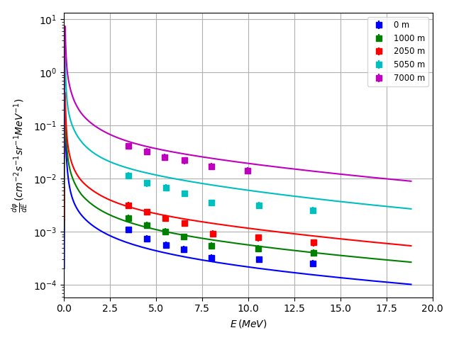

# Background

Gamma rays are a significant component of the mixed radiation field resulting from the interaction of space radiation with the Earth's atmosphere. The total intensity, distribution of energies, and angular distribution all vary with atmospheric depth and other conditions. Models of atmospheric radiation must be able to accurately predict gamma ray intensities.

Researchers have surveyed gamma ray energy spectra at a variety of altitudes, latitude, longitudes, and position in the solar cycle. 

Herein we compare calculations of the Amentum API (using the PARMA model) with published experimental data.

# Results

Figure 1: Energy differential intensity of downward moving gammas as calculated by the Cosmic Ray API and as measured by a NaI spectrometer (square markers) for altitudes shown in the legend.

# Data sources 

Cecchini, S., et al. "On the altitude dependence of gamma-rays spectra in the Earth's atmosphere." International Cosmic Ray Conference. Vol. 2. 2005.

Copyright 2019 Amentum Aerospace, Australia

