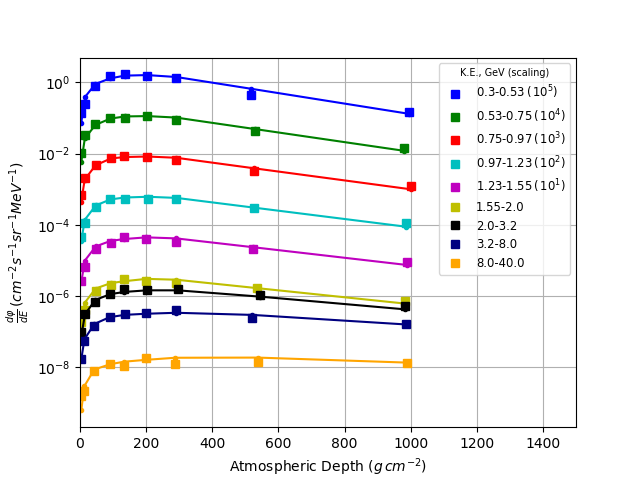

# Background

The CAPRICE94 (Cosmic AntiParticle Ring Imaging Cherenkov) experiments saw a suite of particle detection instrumentation flown on a balloon from Lake Manitoba, Canada. The principal goal of the experiment was to measure muon and anti-muon intensities in the atmosphere in order to improve our understanding of atmospheric neutrino phenomenology.

An overview of the apparatus and experiments can be found in [this](https://arxiv.org/abs/astro-ph/0212253) publication and references therein.

# Results

Figure 1: Vertical muon intensity versus atmospheric depth as calculated by the PARMA model accessed via the Amentum API (solid line) and as measured with the CAPRICE apparatus (square markers). Kinetic energy windows for each plot are shown in the legend. Values are scaled by the factor given in parentheses for clarity.

# Data sources 

Circella, M. "Primary cosmic ray and muon measurements with CAPRICE." Nuclear Physics B-Proceedings Supplements 100.1-3 (2001): 127-129.

Copyright 2019 Amentum Aerospace, Australia

