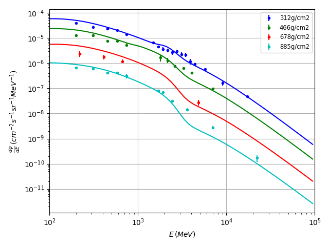

# Background

The CAPRICE (Cosmic AntiParticle Ring Imaging Cherenkov) experiments saw a suite of particle detection instrumentation flown on a balloon from Fort Sumner, USA. The principal goal of the experiment was the detection of cosmic ray anti-particles as evidence of extraordinary sources such as annihilation of dark matter, as well as evidence of conjectured anti-stars. The experiments also provided valuable insights into the composition and intensity of the mixed radiation fields of Earth's atmosphere induced by Galactic Cosmic Ray interactions in the atmosphere.

An overview of the apparatus and experiments can be found in [this](https://arxiv.org/abs/astro-ph/0212253) and references therein.

# Results

Figure 1: Energy differential proton intensity for atmospheric depths shown in the legend.

# Data sources 

Mocchiutti, Emiliano. Atmospheric and interstellar cosmic rays measured with the caprice98 experiment. Diss. Fysik, 2003. 